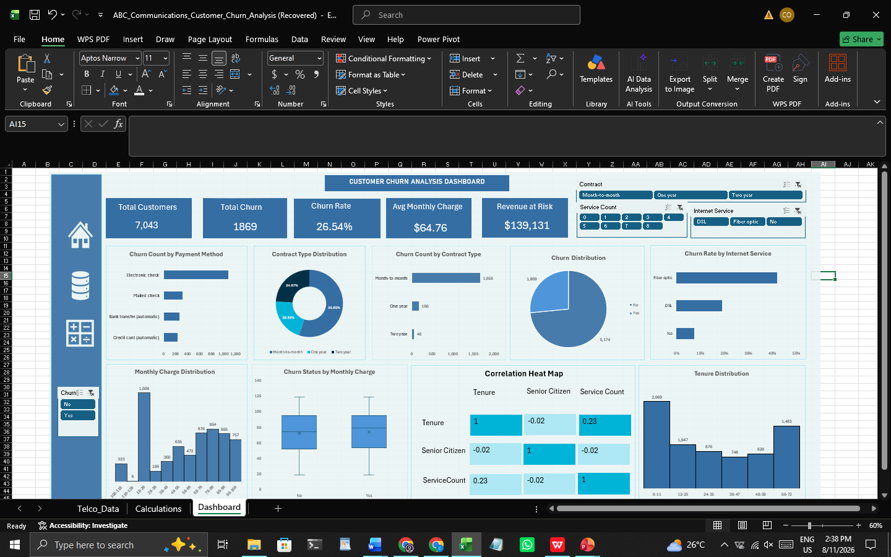

# Telco Customer Churn Analysis

## Project Overview

This project analyzes customer churn patterns using the Telco Customer Churn dataset. The analysis explores customer characteristics, contract types, tenure, monthly charges, and service adoption to identify patterns associated with customer churn and retention.

## Business Problem

ABC Communications Ltd wants to better understand customer churn and identify customer segments and service patterns associated with higher churn.

## Objectives

- Measure customer churn and churn rate
- Identify customer segments with higher churn
- Examine the relationship between tenure and customer behavior
- Analyze service adoption using ServiceCount
- Explore the relationship between selected customer variables using correlation analysis
- Develop an interactive Excel dashboard to support business decision-making

## Dataset

The project uses the Telco Customer Churn dataset.

The unit of observation is one customer per row.

The dataset contains customer demographic information, account information, services, charges, contract information, and churn status.

## Data Preparation

The analysis included:

- Data quality inspection
- Missing-value checks
- Duplicate customer ID checks
- Validation and conversion of charge fields to numeric values
- Review of categorical values
- Creation of ServiceCount
- Creation of helper calculations for interactive analysis

## Analysis

The project uses:

- Excel PivotTables
- PivotCharts
- Slicers
- KPI calculations
- Box plot analysis
- Correlation analysis
- Correlation heat map
- Interactive dashboard

## Key Findings

Key findings from the final analysis will be documented here after the dashboard and analysis have been finalized.

## Recommendations

Recommendations will be based on the final analytical findings and will focus on customer retention and higher-risk customer segments.

## Dashboard

## Tools Used

- Microsoft Excel
- PivotTables
- Excel formulas
- Conditional formatting
- Data visualization
- GitHub

## Project Files

- [Business Understanding Report](reports/Business_Understanding_Report.pdf)
- [Dataset Inspection Report](reports/Dataset_Inspection_Report.pdf)
- [Excel Analysis Workbook](excel/Telco_Churn_Analysis.xlsx)
- [Presentation](presentation/Telco_Churn_Analysis.pptx)
